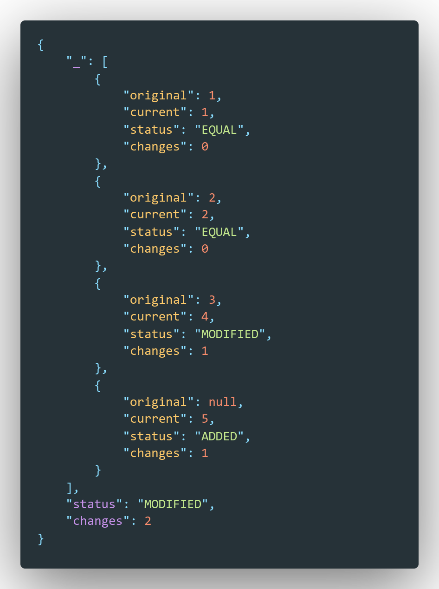

 
 - Completely rewritten
 - The new version 3.x is  **x2 faster** than the older one (version <= 2.x)
 - Support for **Node.js** and **Browsers** (it works on both)

## Synopsis

  

Differify allows you to get the difference between two entities (objects, arrays, dates, functions, numbers, etc) very easily, quickly and in a friendly way.

## Your contribution is appreciated (thanks!)

  

  

---

  

## Installation

  

npm install @netilon/differify

  

## How to use it

  

Comparing things with differify is **very simple**!

### **> Compare objects**

### **> object diff output**

### **> Compare arrays**

### **> array diff output**

### **Simple Structure**
As you can see, there are two different kinds of structures that you can get from `compare` method call.

1) For objects and arrays **only**, you will get this structure:

	
  
	- the `_` property contains the detailed diff information (it's an underscore to improve the readability in complex nested objects property accesses)
	- the `status` property contains the global status of the comparison ('EQUAL', 'MODIFIED', 'DELETED', 'ADDED')
	- the `changes` property is the total changes found when the comparison was performed.
  
2) For anything that `Object.prototype.toString.call()` does NOT return `[object Array]` or `[object Object]` (functions, dates, numbers, etc), you will get this structure:
   
	 

	 - the `original` property has the **original** value (left parameter in `compare` method).
	 - the `current` property has the **current** value (right parameter in `compare` method).
	 - the `status` property contains the current status of the comparison ('EQUAL', 'MODIFIED', 'DELETED', 'ADDED')
	 - the `changes` property will be 1 or 0 depending if there was a change or not.

# Documentation

## Methods

  

**Method:**

*setConfig(_object_);*

  

**Description:** It sets the configuration options that will be applied when compare() method is called.

  

**Params:**

Configuration Object (see the Config section).

  

---

  

**Method:**

*compare(_any_, _any_);*

  

**Description:** It returns the difference between two entities.

  

**Params:**

Both parameters indicate the entities to be compared.

  

---

  

## Configuration

  

You can pass a config to the setConfig() method to change the behavior and adjust it to fit your needs. If you prefer, you can set it once and use it everywhere or you can change it when you need it.

| key | value | default | description
|--|--|--|--|
| _mode.array_  | string | REFERENCE | **DIFF**: it will iterate over each element in the array A, and will compare each element against the element in the same index in the array B.  **REFERENCE**: just compare the references of each array.  **STRING**: only will check the array length and will do a toString comparison if necessary. |
| _mode.object_  | string | REFERENCE | **DIFF**: it will iterate over each property in the object A and will compare each value with the same property value in the object B.  **REFERENCE**:  just compare the references of each object.  **STRING**: only do a toString comparison. |
| _mode.function_  | string | REFERENCE | **REFERENCE**:  just compare the references of each function.  **STRING**: only do a toString comparison (useful to compare the function bodies). |

**Configuration example:**

    const Differify = require('@netilon/differify');
    
    differify = new Differify({ mode: { object: 'DIFF', array: 'DIFF' } });
    
    const diff = differify.compare(a, b);

  

if you dont specify any configuration, the default options are the following:

  

    {
	    mode: {
	    array: 'REFERENCE',
	    object: 'REFERENCE',
	    function: 'REFERENCE',
    }

  

## Examples

You have to know that the configuration you provide will change the behavior of the comparators and it will result in different outputs. 

Just play around with it and use the configuration that fits your needs.

The following image, **just represents the idea** of what each option does, but **is not** the real implementation:

  

  

*Eg:*

  

#with the option ***DIFF***:

    const testA = [1,2];
    const testB = [1,3];

  

you will get this output (note that there is a detail for each element in the array A and B):

  

	{
		"_": [{
			"original": 1,
			"current": 1,
			"status": "EQUAL",
			"changes": 0
		}, {
			"original": 2,
			"current": 3,
			"status": "MODIFIED",
			"changes": 1
		}],
		"status": "MODIFIED",
		"changes": 1
	}

  

#with the option ***STRING***:

  

    const testA = [1,2];
    const testB = [1,3];

  

you will get this output (just a string comparison):

  

	{
		// no diff info 
		// (because it's just string comparison)
		"_": null, 
		"status": "MODIFIED",
		// always will be 1 or 0 because there is no
		// deep checking (just DIFF option do that)
		"changes": 1 
	}

  

## Your contribution is appreciated (thanks!)

  

  

