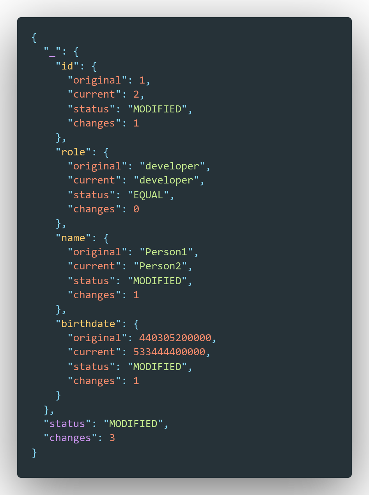
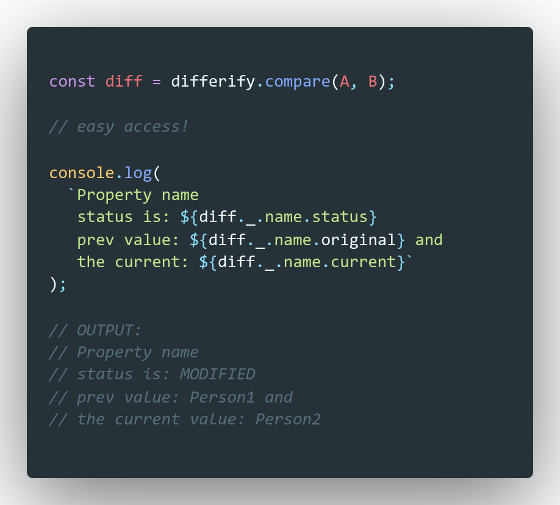
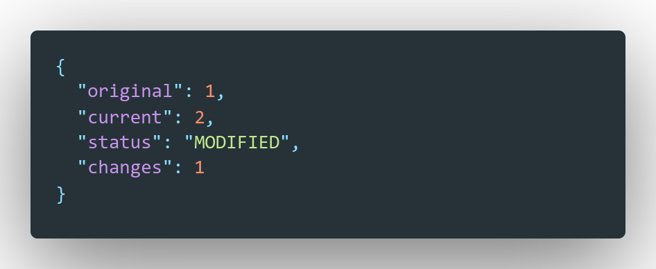

## One of the Fastest **deep** object/array diff

- Benchmarks with other popular packages on the same category:
		
		
		@netilon/differify x 1,045,377 ops/sec ±1.42% (93 runs sampled)

		deep-object-diff x 184,838 ops/sec ±2.55% (85 runs sampled)

		recursive-diff x 108,276 ops/sec ±1.93% (94 runs sampled)

		Fastest is @netilon/differify

## Whats new?
 
 - Completely rewritten
 - The new version 3.x is  **x2 faster** than the older versions (version < 3.0.0)
	 and is now one of the **Fastests deep object/array** comparators.
 - Support for **Node.js** and **Browsers** (it works on both)
 - Just **6.7K (gzipped 2K)** weight (import)
 - **No dependencies**
 - **New features** were added! Now you can easily do more things with differify!
     - new config option added. Now, you can decide whether you prefer to compare arrays, either in an `ordered` or in an `unordered` way. Remember that, by default, you have an ordered comparison.
     - you can apply changes (merge) from `left to right` (applyRightChanges) or `right to left` (applyLeftChanges)
     - you can just `keep the differences between two entities` It's very useful indeed! (see more in the [Documentation](#id3) about the diffOnly option of `apply[Right|Left]Changes` methods). 
     - you can filter the diff result of `compare()` method by an specific status (`ADDED`, `MODIFIED`, `DELETED`, `EQUAL`).

## Synopsis

  

Differify allows you to get the diff between two entities (objects diff, arrays diff, date diff, functions diff, number diff, etc) very easily, quickly and in a friendly way.

## Your contribution is appreciated (thanks!)

  

  

---

  
**Index**   
1. [Installation](#id1)
2. [How to use](#id2)
2. [Documentation](#id3)
2. [Configuration](#id4)
2. [Examples](#id5)

---

## Installation

  

npm install @netilon/differify

  

## How to use it

  

Comparing things with differify is **very simple**!

### **> Compare objects**

### **> Object diff output**

### **> Easy access and use**

### **> Compare arrays**

### **> Array diff output**

### **Simple Structure**
As you can see, there are two different kinds of structures that you can get from `compare` method call.

1) For objects and arrays **only**, you will get this structure:

	
  
	- the `_` property contains the detailed diff information (it's an underscore to improve the readability in complex nested objects property accesses)
	- the `status` property contains the global status of the comparison ('EQUAL', 'MODIFIED', 'DELETED', 'ADDED')
	- the `changes` property is the total changes found when the comparison was performed.
  
2) For anything that `Object.prototype.toString.call()` does NOT return `[object Array]` or `[object Object]` (functions, dates, numbers, etc), you will get this structure:
   
	 

	 - the `original` property has the **original** value (left parameter in `compare` method).
	 - the `current` property has the **current** value (right parameter in `compare` method).
	 - the `status` property contains the current status of the comparison ('EQUAL', 'MODIFIED', 'DELETED', 'ADDED')
	 - the `changes` property will be 1 or 0 depending if there was a change or not.

### **> Apply changes**

# Documentation

## Methods

  

**Method:**

*setConfig(_object_);*

  

**Description:** It sets the configuration options that will be applied when compare() method is called.

  

**Params:**

Configuration Object (see the Configuration section).

**Return:** void

---
  
**Method:**

*getConfig();*

  

**Description:** It returns a copy of the current configuration object.

**Return:** Object

---

  

**Method:**

*compare(_any_, _any_);*

  

**Description:** It returns the difference between two entities.

  

**Params:**

Both parameters indicate the entities to be compared.

**Return:** Object.

---

**Method:**

*applyRightChanges(diffResult, diffOnly);*

  

**Description:** It will apply the changes (merge both entities) and will keep the modified values **from the right**.  

  

**Params:**

*diffResult*: Object - It is the Object returned by the `compare()` method call.

*diffOnly*: boolean - (default: false) It returns just the difference (only the !== `EQUAL` properties).

**Return:** Object.

---

**Method:**

*applyLeftChanges(diffResult, diffOnly);*

  

**Description:** It will apply the changes (merge both entities) and will keep the modified values **from the left**.  

  

**Params:**

*diffResult*: Object - It is the Object returned by the `compare()` method call.

*diffOnly*: boolean - (default: false) It returns just the difference (only the !== `EQUAL` properties).

**Return:** Object.

---

**Method:**

*filterDiffByStatus(diffResult, status);*

  

**Description:** It will return the changes that match with the specified status (second parameter).  

  

**Params:**

*diffResult*: Object - It is the Object returned by the `compare()` method call.

*status*: string - one of the following (`ADDED` || `MODIFIED` || `DELETED` || `EQUAL`).

**Return:** Object || Array - depending on if the input is an Object or an Array.

---

  

## Configuration

  

You can pass a config to the setConfig() method to change the behavior and adjust it to fit your needs. If you prefer, you can set it once and use it everywhere or you can change it when you need it.

| key | value | default | description
|--|--|--|--|
| _mode.array_  | string | DIFF | **DIFF**: it will iterate over each element in the array A, and will compare each element against the element in the same index in the array B.  **REFERENCE**: just compare the references of each array.  **STRING**: only will check the array length and will do a toString comparison if necessary. |
| _mode.object_  | string | DIFF | **DIFF**: it will iterate over each property in the object A and will compare each value with the same property value in the object B.  **REFERENCE**:  just compare the references of each object.  **STRING**: only do a toString comparison. |
| _mode.function_  | string | REFERENCE | **REFERENCE**:  just compare the references of each function.  **STRING**: only do a toString comparison (useful to compare the function bodies). |
| _compareArraysInOrder_  | boolean | true | if it is `true`, it will compare each element in both arrays one by one in an ordered way, assuming that each element, in the same index in both arrays, should be the same element that can have changes or not ([see an example of this case](#id6)). If the option is set to `false`, then it will compare each element in both arrays and it will check if they are `EQUAL`, `ADDED` or `DELETED` without keeping in mind the appearence order (there won't be details about the `MODIFIED` status, it's only available if the option is set to true, since in that case, the order matters and we know that each element in the same index (but in different arrays), should be the same element that could have been changed or not) ([see an example of this case](#id7)).

**Configuration example:**

    const Differify = require('@netilon/differify');
    
    differify = new Differify({ mode: { object: 'DIFF', array: 'DIFF' } });
    
    const diff = differify.compare(a, b);

  

if you dont specify any configuration, the default options are the following:

  

    {
	    mode: {
	    array: 'DIFF',
	    object: 'DIFF',
	    function: 'REFERENCE',
    }

  

## Examples

You have to know that the configuration you provide will change the behavior of the comparators and it will result in different outputs. 

Just play around with it and use the configuration that fits your needs.

The following image, **just represents the idea** of what each option does, but **is not** the real implementation:

  

  

*Eg:*

  

### with the option ***DIFF***:

    const testA = [1,2];
    const testB = [1,3];

  

you will get this output (note that there is a detail for each element in the array A and B):

  

	{
		"_": [{
			"original": 1,
			"current": 1,
			"status": "EQUAL",
			"changes": 0
		}, {
			"original": 2,
			"current": 3,
			"status": "MODIFIED",
			"changes": 1
		}],
		"status": "MODIFIED",
		"changes": 1
	}

  

### with the option ***STRING*** or ***REFERENCE***:

  

    const testA = [1,2];
    const testB = [1,3];

  

you will get this output (just a string comparison):

  

	{
		// no diff info 
		// (because it's just string comparison)
		"_": null, 
		"status": "MODIFIED",
		// always will be 1 or 0 because there is no
		// deep checking (just DIFF option do that)
		"changes": 1 
	}

### Array comparison example, keeping the order (compareArraysInOrder: true) 

	const differify = new Differify({
		compareArraysInOrder: true, //default value
		mode: { object: 'DIFF', array: 'DIFF' },
	});

	const diff = differify.compare(['a', 'b'], ['a', 'z', 'b']);

	/*
		OUTPUT

		{
			"_": [{
				"original": "a",
				"current": "a",
				"status": "EQUAL",
				"changes": 0
			}, {
				"original": "b",
				"current": "z",
				"status": "MODIFIED",
				"changes": 1
			}, {
				"original": null,
				"current": "b",
				"status": "ADDED",
				"changes": 1
			}],
			"status": "MODIFIED",
			"changes": 2
		}
	
	*/

### Array comparison example, without having the order in mind (compareArraysInOrder: false).. 
**NOTE**: In case you have Object elements inside the array and you are using compareArraysInOrder to false and array mode to true, then it is not possible to do a deeper object comparison because there is no way to know which element in the array A is related to another element in the array B, that's because the comparison is made in a non deeper way (STRING mode is the fallback) for this particular case (under the mentioned configuration) 

	const differify = new Differify({
		compareArraysInOrder: false,
		mode: { object: 'DIFF', array: 'DIFF' },
	});

	const diff = differify.compare(['a', 'b'], ['a', 'z', 'b']);

	/*
		OUTPUT

		{
			"_": [{
				"original": "a",
				"current": "a",
				"status": "EQUAL",
				"changes": 0
			}, {
				"original": "b",
				"current": "b",
				"status": "EQUAL",
				"changes": 0
			}, {
				"original": null,
				"current": "z",
				"status": "ADDED",
				"changes": 1
			}],
			"status": "MODIFIED",
			"changes": 1
		}
	
	*/

## Your contribution is appreciated (thanks!)

  

  

